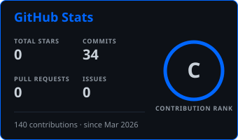

  

  <strong>17 · Almaty, Kazakhstan</strong> 
  Incoming Data Science &amp; AI student at KBTU · Building at the intersection of AI, robotics and real-world problems

## About

I'm a 17-year-old developer focused on understanding how AI can solve useful problems across different fields. I learn best by building—from ML experiments to ESP32 projects that bring software closer to the physical world.

## Currently

- **ML engineering** — interning at a large Kazakhstani company
- **Robotics** — building ESP32 side projects to understand robotics more deeply
- **Daily practice** — studying AI engineering every day

## GitHub Activity

  
  

  

  

## Interests

  📷 Photography (iPhone 17 Pro) &nbsp;·&nbsp; 🏓 Table tennis &nbsp;·&nbsp; 🎾 Tennis &nbsp;·&nbsp; ⚽ Football 
  ∑ Mathematics &nbsp;·&nbsp; ♟️ Chess &nbsp;·&nbsp; ⚡ Microchips &amp; electronics &nbsp;·&nbsp; 🧠 NeuroAI

## Contact

  
  

